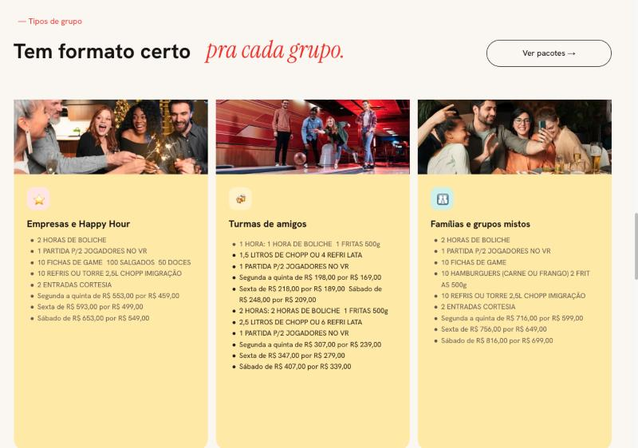
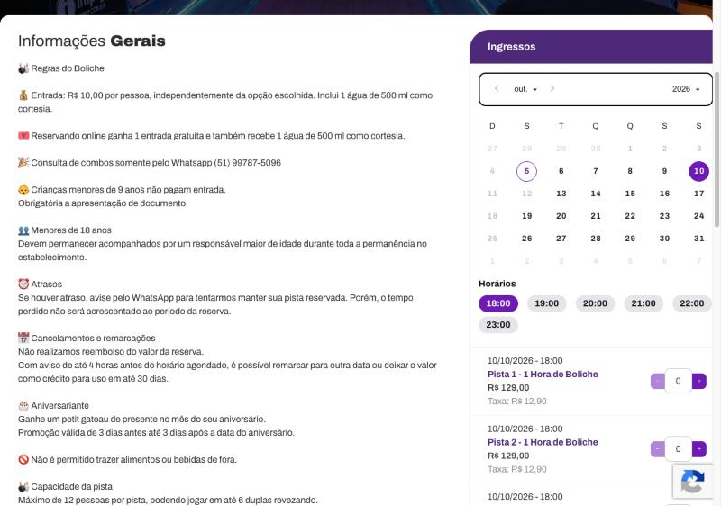
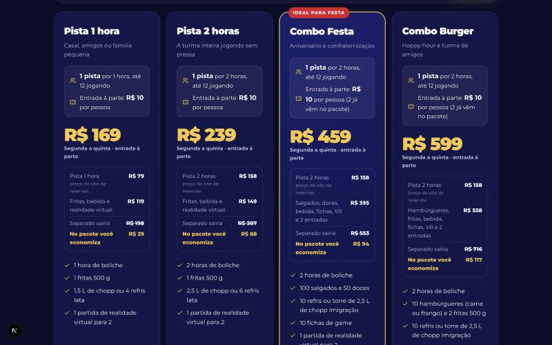

# De onde vêm os pacotes, preços e regras

Conferido em **05/10/2026**. Se o cliente perguntar "de onde tiraram isso?", a resposta
está aqui, com a captura de cada fonte. O teste `tests/unit/precos.test.ts` trava os
valores: mudar preço no site sem atualizar o teste quebra o build.

## 1. Pacotes (combos) — site atual da Strike

**Fonte:** https://www.strikeberlin.com.br/ → seção **"Tipos de grupo — Tem formato certo
pra cada grupo"**.

| No site novo | No site atual (card) | Itens | Seg–Qui | Sexta | Sábado |
|---|---|---|---|---|---|
| Pista 1 hora | Turmas de amigos ("1 HORA") | 1 h de boliche, 1 fritas 500 g, 1,5 L de chopp ou 4 refri lata, 1 partida de VR p/ 2 | de R$ 198 por **R$ 169** | de R$ 218 por **R$ 189** | de R$ 248 por **R$ 209** |
| Pista 2 horas | Turmas de amigos ("2 HORAS") | 2 h de boliche, 1 fritas 500 g, 2,5 L de chopp ou 6 refri lata, 1 partida de VR p/ 2 | de R$ 307 por **R$ 239** | de R$ 347 por **R$ 279** | de R$ 407 por **R$ 339** |
| Combo Festa | Empresas e Happy Hour | 2 h de boliche, 1 partida de VR p/ 2, 10 fichas de game, 100 salgados, 50 doces, 10 refris ou torre 2,5 L de chopp Imigração, 2 entradas cortesia | de R$ 553 por **R$ 459** | de R$ 593 por **R$ 499** | de R$ 653 por **R$ 549** |
| Combo Burger | Famílias e grupos mistos | 2 h de boliche, 1 partida de VR p/ 2, 10 fichas de game, 10 hambúrgueres (carne ou frango), 2 fritas 500 g, 10 refris ou torre 2,5 L de chopp Imigração, 2 entradas cortesia | de R$ 716 por **R$ 599** | de R$ 756 por **R$ 649** | de R$ 816 por **R$ 699** |

O Eleven Tickets **não vende combo**: lá está escrito "Consulta de combos somente pelo
Whatsapp (51) 99787-5096" (captura 2). Por isso o botão de cada pacote abre o WhatsApp.

## 2. Pista avulsa e regras da casa — Eleven Tickets

**Fonte:** https://eleventickets.com/strike-berlin/strike-berlin → "Informações Gerais" e
"Ingressos" (1 hora de boliche por pista).

| Dia | Preço da pista (1 h) | Taxa do site | Captura |
|---|---|---|---|
| Segunda a quinta (ex.: 08/10) | **R$ 79,00** | R$ 7,90 | 3 |
| Sexta (ex.: 30/10) | **R$ 99,00** | R$ 9,90 | 4 |
| Sábado (10/10 e 31/10) | **R$ 129,00** | R$ 12,90 | 2 e 5 |

Horários de 18h a 23h. Domingo e o feriado de 12/10 não abrem para reserva online.

Regras publicadas ali e usadas no site novo:

- Entrada **R$ 10 por pessoa**, com 1 água de 500 ml.
- **Reservando online, 1 entrada gratuita.**
- **Menores de 9 anos não pagam entrada** (com documento).
- Menores de 18 acompanhados de responsável maior de idade.
- **Máximo de 12 pessoas por pista**, em até 6 duplas revezando.
- **Não é permitido trazer alimentos ou bebidas de fora.**
- Aniversariante ganha petit gâteau (de 3 dias antes a 3 dias depois).
- Sem reembolso; com aviso de 4 h, remarca ou vira crédito por 30 dias.

Capturas dos outros dias: [quinta 08/10](fontes/3-eleventickets-quinta-08-10.jpg) ·
[sexta 30/10](fontes/4-eleventickets-sexta-30-10.jpg) ·
[sábado 31/10](fontes/5-eleventickets-sabado-31-10.jpg).

## 3. Por que o pacote custa mais que a pista — e para quantas pessoas

> **Para quantas pessoas a comida rende, nenhuma fonte diz.** A Pista 1 hora traz **uma**
> fritas de 500 g e "1,5 L de chopp **ou** 4 refri lata" — não dá para afirmar "para 4".
> Por isso o card mostra só as quantidades do pacote, sem número de pessoas na comida.

**O preço "de" de cada pacote é exatamente 1 pista no preço do Eleven Tickets + um valor
fixo dos itens.** A conta fecha nos três dias, o que mostra que cada pacote é **1 pista**:

| Pacote | "De" (site atual) seg / sex / sáb | Pista no Eleven Tickets | Itens (valor fixo) |
|---|---|---|---|
| Pista 1 hora | 198 / 218 / 248 | 1 h: 79 / 99 / 129 | **R$ 119** (fritas, bebida e VR) |
| Pista 2 horas | 307 / 347 / 407 | 2 h: 158 / 198 / 258 | **R$ 149** (fritas, bebida e VR) |
| Combo Festa | 553 / 593 / 653 | 2 h: 158 / 198 / 258 | **R$ 395** (salgados, doces, bebida, fichas, VR, 2 entradas) |
| Combo Burger | 716 / 756 / 816 | 2 h: 158 / 198 / 258 | **R$ 558** (hambúrgueres, fritas, bebida, fichas, VR, 2 entradas) |

Por isso cada card mostra a conta: **pista + itens = "separado sairia"**, e quanto o pacote
economiza. Ex.: Pista 1 hora de segunda a quinta = R$ 79 + R$ 119 = R$ 198 separado, ou
**R$ 169 no pacote** (economia de R$ 29). O teste `precos.test.ts` confere essa conta.

| No card | De onde vem |
|---|---|
| "**1 pista** por 1 h / 2 h" | **Conta acima:** o "de" é sempre 1 pista + itens. |
| "até **12** jogando" | **Fonte:** regra do Eleven Tickets (12 por pista). |
| "Entrada à parte: R$ 10 por pessoa" | **Fonte:** regra do Eleven Tickets; "2 entradas cortesia" vem do item do combo. |
| Valor dos itens (R$ 119, 149, 395, 558) | **Conta nossa:** "de" do site atual − pista do Eleven Tickets. |
| "50% antecipado" | **Fonte:** FAQ do site atual. |

## 4. O que é texto nosso (não está nas fontes)

- Os **nomes** "Pista 1 hora", "Pista 2 horas", "Combo Festa" e "Combo Burger". O site
  atual não dá nome aos pacotes; só os separa em cards de grupo.
- A linha de **"para quem"** de cada card e o selo "Ideal para festa".
- A **oferta de doce extra** do Dia das Crianças: veio do pedido do cliente, sem
  quantidade nem validade definidas ainda.

**A confirmar com a Roseli:** para quantas pessoas ela indica cada pacote (a pista recebe
até 12; a comida, nenhuma fonte diz); quantidade e validade do doce extra.
